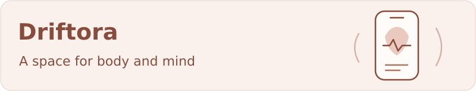
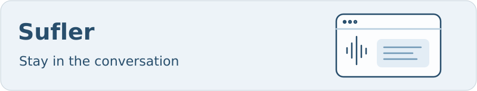
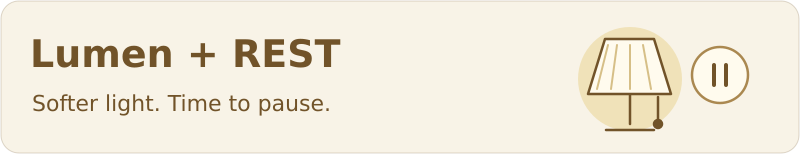

## Hi, I'm Eugene

**Python backend developer · Independent product builder**

I turn ideas into APIs, AI tools and apps. My products live at **[Family Pie](https://family-pie.ru)**.

[Studio & products](https://family-pie.ru) &nbsp; / &nbsp; [Email](mailto:leos2111@gmail.com) &nbsp; / &nbsp; [Telegram](https://t.me/SpiritusMalus21)

## Selected work

Nutrition, mood and journaling, with **encrypted local storage** and optional AI food logging.

`React Native` `Expo` `TypeScript` `SQLite`

[Explore Driftora](https://family-pie.ru/driftora/subscription/) · [View source](https://github.com/SpiritusMalus/Driftora)

 

A desktop overlay with **live transcription, screen analysis and contextual AI answers**.

`Electron` `React` `Deepgram` `OpenRouter` &nbsp; Windows & macOS · Beta · Private source

[Download & setup](https://family-pie.ru/sufler/)

 

**Screen warmth and break reminders.** Native macOS app; separate Windows and Linux beta builds.

Display controls vary by platform · Private source

[Explore Lumen + REST](https://family-pie.ru/rest_lumen/) · [Public releases](https://github.com/SpiritusMalus/lumen-rest-downloads)

 

## Behind the scenes

| Project | Focus |
| :--- | :--- |
| **[Family VPN](https://family-pie.ru/vpn/)** | Self-hosted VPN, web accounts and subscription administration |
| **Project Hub** | Private AI workspace, Git workflows, synchronization and encrypted recovery |
| **WALL-E / Walli** | Desktop robot research: conversation, memory and device integrations; hardware validation ahead |
| **[Family Pie](https://github.com/SpiritusMalus/family-pie)** | Studio website, product downloads and public legal pages |

## My toolkit

**Backend** &nbsp; `Python` `FastAPI` `Django / DRF` `SQLAlchemy`

**Infrastructure** &nbsp; `PostgreSQL` `Docker` `Linux` `Caddy` `GitHub Actions`

**Apps & AI** &nbsp; `TypeScript` `React Native` `Electron` `LLM integrations`

---

Earlier work · Relo Dojo

 

[**Relo Dojo**](https://github.com/SpiritusMalus/relo_dojo) — gamified English practice for developers preparing to relocate. Personalized exercises, XP, streaks and belt progression.

`FastAPI` `Expo / React Native` `LLM`

